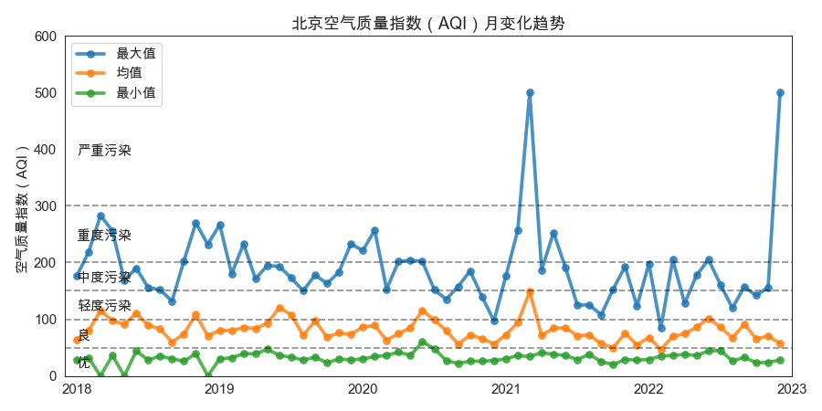
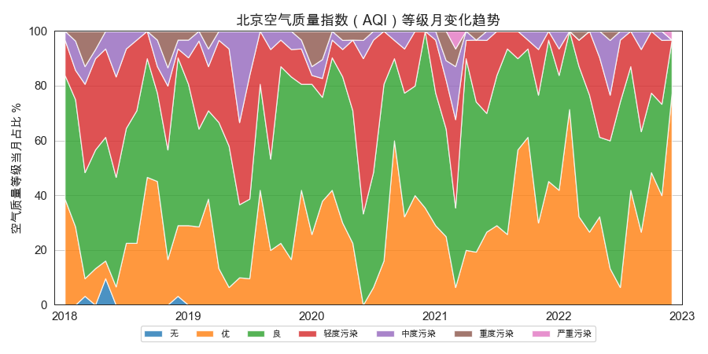
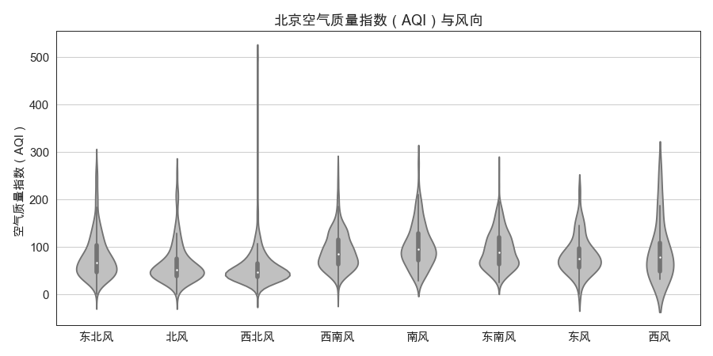
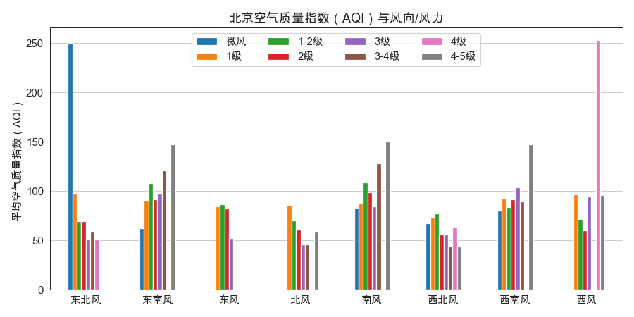
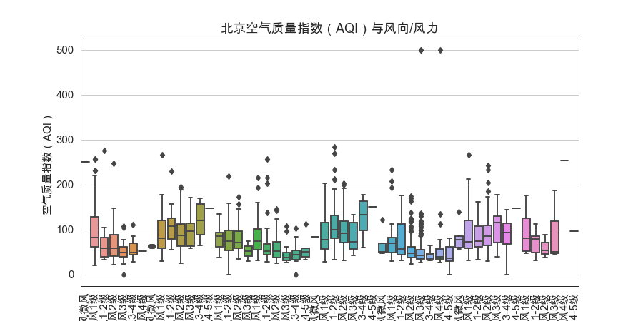

## **Documentation for Air Quality Index Analysis**

毛XX 吴XX \| 学号：xxxx  xxxx

Jan. 2023

### 1  项目简介

该项目目的为Lecture5和Lecture6中爬虫学习的深化：利用爬取的历史天气数据分析雾霾天气近五年的发展趋势及与风力、风向的关系。

为达该目的，本项目爬取了“[https://www.aqistudy.cn/historydata](https://www.aqistudy.cn/historydata”)”网站上北京市2018.01.01至2022.12.31的雾霾情况数据和天气数据。后续，对爬取得到的相关数据进行统计分析，发现了近五年来北京空气质量逐渐好转的趋势，同时分析得到空气质量与风力、风向等天气因素之间的关系，并通过可视化呈现分析结果。

项目文件：

```sh
.
├── README.md
├── README.pdf  # 本说明文档
├── aqiJS-part1.js
├── aqiJS-part2.js
├── aqiJS-part3.js
├── data_北京.csv  # 合并后的数据
├── figure_1.png
├── figure_2.png
├── figure_3.png
├── figure_4.png
├── figure_5.png
├── historyaqi
├── weather_北京.csv
├── 大作业：雾霾数据爬取与分析.html  # 代码也可以看这个html文件
└── 大作业：雾霾数据爬取与分析.ipynb  # 代码
```

### 2  流程描述

#### 2.1 获取AQI数据

- 空气质量 [来源网站](https://www.aqistudy.cn/historydata/)
- [解码器获取地址](https://www.aqistudy.cn/historydata//daydata.php?city=北京&month=201402)

主要函数：

| 函数名            | 功能                                  | 参数                                               |
| ----------------- | ------------------------------------- | -------------------------------------------------- |
| `get_renewed_ctx` | 读取js文件，准备执行Java脚本的ctx对象 | /                                                  |
| `get_historyapi`  | 获取AQI数据                           | city, date_times, url, ajax_data_key, ctx, headers |
| `save_text2df`    | 将文本数据保存为csv格式               | temp_text, ajax_success_, ctx, save_path, silent   |

执行 `get_historyapi` 前，需要手动获取密钥/JS函数名称空间

1. 打开 [网址](https://www.aqistudy.cn/historydata//daydata.php?city=北京&month=202212)，IP未封禁时能看到该城市当月空气质量状况
2. F12 (或 View -> Developer -> Developer Tools) 调试“网络”，刷新页面
3. 控制台报错信息，展开，紧随'showTable', 'eval'后名称最长的函数，所在脚本开头为密钥，复制整段到`aqiJS-part1.js`
4. 新的`aqiJS-part1.js`178行是一个参数为城市+日期的函数，复制函数名，更新到`aqiJS-part3.js`第六行
6. 新的`aqiJS-part1.js`182行data的键值作为下一个Cell内的`ajax_data_key`，186行较长的函数名作为下一个Cell内的`ajax_success_`
5. `aqiJS-part2.js`无需改动，来自独立的解码器js，需要[反混淆](https://worldwebtool.com/javascript-deobfuscator)
6. 如果下一个Cell运行终止，说明密钥已更新，重复上述过程2.-5.

#### 2.2 获取天气数据

直接在json网址中指定城市编号和日期的方式获取天气数据，并将数据同样保存为csv格式。

- 风力/风向来源网站：[2345天气王](http://tianqi.2345.com)
- [参考资料](https://yonniye.com/archives/11.html): [不规范JSON解析矫正](https://jsonlint.com/)

#### 2.3 数据合并

将AQI数据与weather数据进行合并处理，展示前5行如下表：

| date       |  aqi | pm2_5 | pm10 |  so2 |  no2 |   co |   o3 | rank | quality | fengxiang | fengli | bWendu | yWendu | tianqi  |
| :--------- | ---: | ----: | ---: | ---: | ---: | ---: | ---: | ---: | :------ | :-------- | :----- | :----- | :----- | :------ |
| 2018-01-01 |   57 |    34 |   63 |    9 |   44 |    1 |   38 |   84 | 良      | 东北风    | 1-2级  | 3℃     | -6℃    | 晴~多云 |
| 2018-01-02 |   50 |    28 |   50 |    7 |   33 |  0.8 |   46 |   57 | 优      | 东北风    | 1-2级  | 2℃     | -5℃    | 阴~多云 |
| 2018-01-03 |   28 |    11 |   28 |    5 |   21 |  0.4 |   51 |   11 | 优      | 北风      | 1-2级  | 2℃     | -5℃    | 多云    |
| 2018-01-04 |   40 |    15 |   30 |    4 |   32 |  0.5 |   39 |  118 | 优      | 东北风    | 1-2级  | 0℃     | -8℃    | 阴      |
| 2018-01-05 |   63 |    32 |   54 |    8 |   50 |  0.9 |   36 |  172 | 良      | 西北风    | 1-2级  | 3℃     | -6℃    | 多云~晴 |

#### 2.4 数据分析

对爬取到的2018-2022年北京市雾霾数据和天气数据进行统计分析，得到AQI的变化趋势和与风力、风向等天气因素的关系，并对分析结果进行可视化处理。

### 3  数据分析结果

#### 3.1 雾霾近五年变化趋势

我们以月为分析粒度，研究月度下北京空气质量指数（AQI）的最大值、最小值和均值在近五年的变化趋势。



**图1 北京空气质量指数（AQI）月变化趋势**

从图1中可以得到看出，总体上，北京月度空气质量指数的均值和最小值在近五年内维持稳定，而最大值呈下降趋势，但在2021年初和2022年末出现了极端值，空气质量达到了严重污染的程度。

进一步分析各空气质量等级占比的变化趋势。



**图2 北京空气质量指数（AQI）等级月变化趋势**

从图2中可以看出，北京空气质量等级呈现明显的季节性，冬春时节的空气质量显著差于夏秋时节，各程度污染占比显著高于夏秋时节对应占比。同季节下对比，总体上看，轻度污染、中度污染、重度污染的天数占比呈现下降趋势，2022年下降尤为明显，而空气质量优良的天数占比相应呈现上升趋势，北京的空气质量得到改善。

#### 3.2 雾霾与风向/风力的关系

首先分析空气质量指数（AQI）与风向的关系，我们绘制了北京空气质量指数（AQI）与八个不同风向的小提琴图。



**图3 北京空气质量指数（AQI）与风向关系**

从图3可以看出，总体上，北风或偏北风天气下的空气质量指数显著低于其他风向，空气质量更好，而南风或偏南风天气下的空气质量指数相对更高，空气质量更差。接着我们将风向和风力结合，共同分析其对北京空气质量的影响。



**图4 北京空气质量指数（AQI）与风向/风力柱形图**



**图5 北京空气质量指数（AQI）与风向/风力箱线图**

从图4和图5可以看出，与图3分析类似，北风和偏北风空气质量指数较低，南风和偏南风空气质量指数较高。在相同风向下对风力的影响进行进一步分析，北风或偏北风天气下，风力等级越高，污染指数越低，总体空气质量指数在50上下波动；而在南风或偏南风天气下，风力等级越高，污染指数也越高，总体空气质量指数在100上下波动；在东风和西风天气下，风力等级对污染指数的影响不显著。

### 4  总结与展望

本项目基于课程的爬取天气数据项目，进一步爬取近五年北京市的空气质量数据和天气数据，并对得到的数据进行分析处理和可视化。通过数据分析发现，近五年来北京市的空气质量指数呈下降趋势，空气质量逐渐好转。同时，分析还发现了空气质量指数与风力和风向之间的关系：北风或偏北风天气下，空气质量指数较低，空气较好，而南风或偏南风天气下，空气质量指数较高，空气较差。更进一步，在北风或偏北风天气下，风力等级越高，空气质量指数越低，空气越好；而南风或偏南风天气下，风力等级越高，空气质量指数越高，空气越差。

本研究还存在一些不足和需要后续改进的地方：首先，我们可以尝试定量分析和更严谨的统计学回归方法给出风力、风向对于空气质量的定量影响。其次，本研究的数据仅聚焦于北京一个城市，后续可以尝试采用并发爬虫爬取多个城市的数据，让研究样本更加丰富。
# AQI-Analysis
